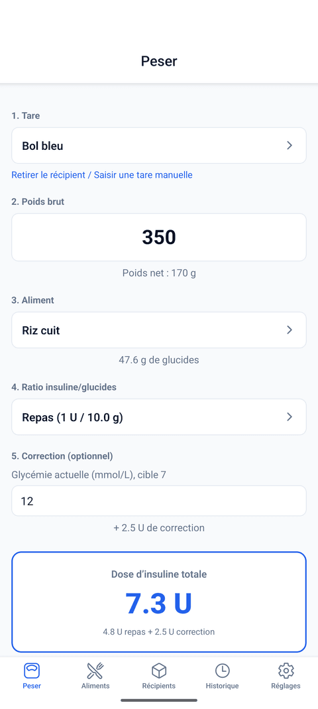
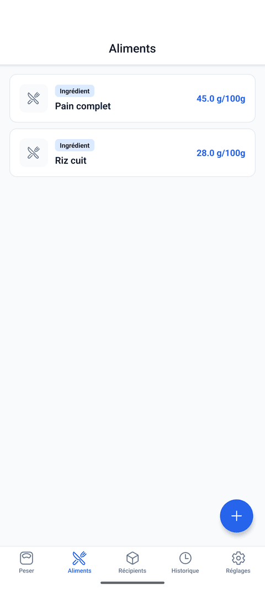
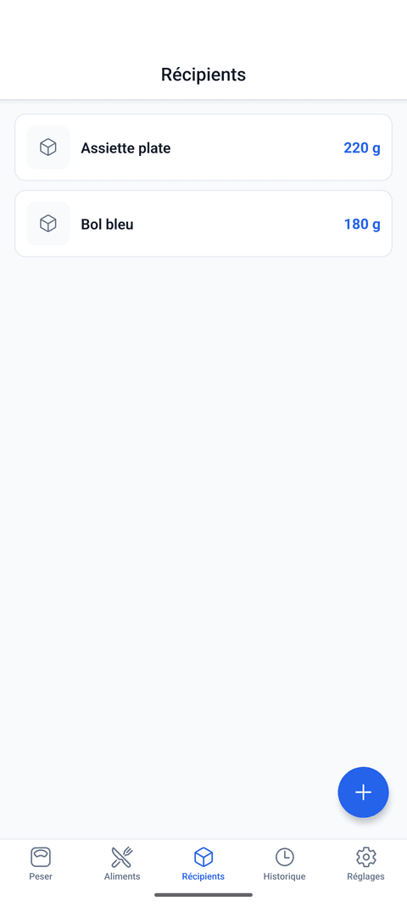
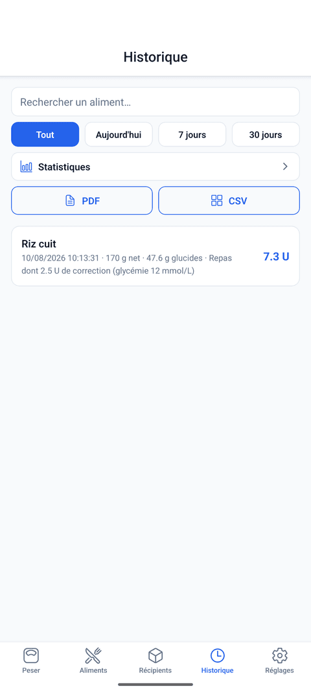
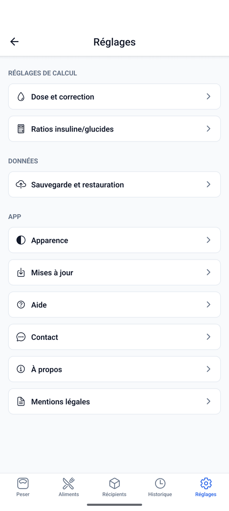
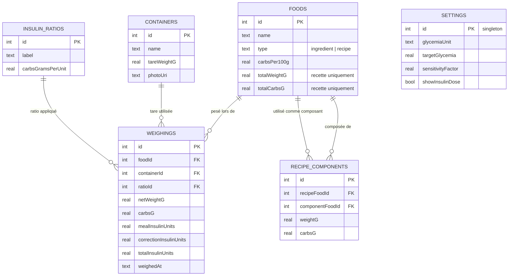

<div align="center">

# 🩺 GlucoDose

**Calculateur de dose d'insuline au repas — pesée, aliments, recettes et correction, sans calculette.**


[](https://buymeacoffee.com/forthtilliath)

</div>

---

> [!CAUTION]
> **Ceci n'est pas un dispositif médical.** C'est un outil personnel d'aide au calcul, construit pour un usage individuel. Les ratios insuline/glucides, le facteur de sensibilité et les valeurs glucidiques saisies doivent provenir de ton équipe soignante (diététicien·ne, diabétologue). Vérifie toujours une dose avant de l'injecter. En cas de doute, fie-toi à ton jugement clinique et à celui de ton équipe de soins, jamais uniquement à cette application.

## Captures d'écran

<div align="center">
<table>
<tr>
<td align="center" width="20%"><br/><sub><b>Peser</b></sub></td>
<td align="center" width="20%"><br/><sub><b>Aliments</b></sub></td>
<td align="center" width="20%"><br/><sub><b>Récipients</b></sub></td>
<td align="center" width="20%"><br/><sub><b>Historique</b></sub></td>
<td align="center" width="20%"><br/><sub><b>Réglages</b></sub></td>
</tr>
</table>
</div>

## Pourquoi cette app

À chaque repas, gérer un diabète sous insuline demande de :

1. peser chaque aliment (et donc connaître le poids à vide du récipient utilisé),
2. convertir ce poids en glucides,
3. convertir ces glucides en unités d'insuline via son ratio personnel,
4. éventuellement ajouter une correction si la glycémie est trop haute.

Cette app remplace la calculette : elle mémorise les poids de récipients, les valeurs glucidiques des aliments et recettes déjà utilisés, et fait tous les calculs à la volée pendant la pesée.

## Fonctionnalités

| Écran | Rôle |
|---|---|
| **⚖️ Peser** | Flux principal : choisir un récipient (ou une tare manuelle) → peser → poids net automatique (avec avertissement si le poids saisi est inférieur à la tare) → choisir l'aliment → choisir le ratio → dose repas + correction optionnelle affichées en direct. Un écran de résultat confirme l'enregistrement et permet d'**annuler** la pesée en un tap. Un réglage permet de s'arrêter au calcul des glucides, sans dose (voir Réglages) |
| **🍽️ Aliments** | CRUD des ingrédients simples (glucides/100g) et des recettes composées, chacun avec une **photo** optionnelle. Une recette calcule ses glucides/100g à partir de ses composants pesés, puis devient réutilisable **exactement comme un ingrédient** dans l'écran Peser. Suggestions automatiques depuis la table **Ciqual** (Anses) pendant la frappe, avec une recherche complète accessible en un tap |
| **📦 Récipients** | CRUD des récipients avec leur poids à vide, et une **photo** (prise ou choisie en galerie) pour les repérer d'un coup d'œil dans le sélecteur |
| **⚙️ Réglages** | Activer/désactiver le calcul de dose (mode "glucides seuls"), ratios insuline/glucides (un ou plusieurs, ex. un par repas), glycémie cible et facteur de sensibilité pour la dose de correction, unité (mmol/L ou g/L), apparence (clair/sombre/système), sauvegarde/restauration JSON complète de la base (+ sauvegarde automatique silencieuse), vérification des mises à jour, Aide / Contact / À propos / Mentions légales |
| **🕘 Historique** | Journal des pesées enregistrées avec le détail dose repas / dose de correction, filtrable par nom d'aliment et par période, exportable en **PDF** (pour être partagé, ex. avec ton équipe soignante) ou **CSV** (pour analyser dans un tableur). Sous-écran **Statistiques** : moyenne de glucides/jour, pesées/semaine, aliments les plus utilisés |

Depuis l'écran Peser, les sheets de sélection récipient/aliment permettent aussi d'**ajouter directement** un nouveau récipient, un nouvel aliment/recette, ou un aliment trouvé dans **Ciqual** (créé et sélectionné en un tap, sans quitter l'écran). Tous les champs de recherche (récipient, aliment, ratio, Ciqual) supportent aussi la **recherche vocale**.

Un appui long sur l'icône de l'app propose aussi des **raccourcis directs** : Peser, Nouveau récipient, Nouvel aliment.

### La méthode de calcul

```
glucides pesés   = poids net (poids brut − tare) × (glucides pour 100g de l'aliment) / 100
dose repas       = glucides pesés ÷ ratio insuline/glucides
dose correction  = max(0, (glycémie actuelle − glycémie cible) ÷ facteur de sensibilité)
dose totale      = dose repas + dose correction
```

Point de conception important : **une valeur de glucides/100g est une propriété stable de l'aliment**, alors que le **ratio insuline/glucides est un paramètre personnel** qui peut varier selon le repas (phénomène de l'aube le matin, activité physique, etc.) et évoluer dans le temps. Les deux sont donc stockés séparément — modifier un ratio n'oblige pas à rééditer tous les aliments.

Chaque pesée enregistrée **fige** (snapshot) toutes les valeurs utilisées au moment du calcul (glucides/100g, ratio, cible, facteur). Modifier un aliment ou un réglage plus tard ne change jamais rétroactivement une dose déjà calculée.

## Stack technique

| Domaine | Choix |
|---|---|
| Framework | [Expo](https://expo.dev) (SDK 57) + [Expo Router](https://docs.expo.dev/router/introduction/) (navigation par fichiers) |
| Langage | TypeScript strict |
| Base de données | SQLite embarqué (`expo-sqlite`) via [Drizzle ORM](https://orm.drizzle.team/docs/get-started/expo-new) — schéma typé, migrations versionnées, requêtes réactives (`useLiveQuery`) |
| Photos | `expo-image-picker` (caméra / galerie) + `expo-file-system` (stockage permanent hors cache) |
| État & data | Pas de state manager global : react hooks + requêtes SQL réactives suffisent, pas de réseau à gérer |
| Données | 100% locales, aucun backend, aucun compte utilisateur |

## Modèle de données



## Structure du projet

```
src/
├── app/                          # Écrans (Expo Router)
│   ├── _layout.tsx               # Layout racine : migrations DB + splash screen
│   └── (tabs)/                   # Navigation par onglets
│       ├── index.tsx             # Peser
│       ├── foods/                # Aliments (liste, ingrédient, recette)
│       ├── containers/           # Récipients
│       ├── settings/             # Réglages (ratios, correction)
│       └── history/              # Historique
├── db/
│   ├── schema.ts                 # Schéma Drizzle (source de vérité)
│   ├── client.ts                 # Connexion SQLite + Drizzle
│   └── repository.ts             # Toutes les écritures (create/update/delete)
├── lib/
│   ├── insulin.ts                # Formules de calcul, seule source de vérité
│   ├── ciqual.ts                 # Recherche dans la table Ciqual (Anses) bundlée en local
│   └── photos.ts                 # Stockage permanent des photos de récipients
├── components/
│   └── PickerModal.tsx           # Sélecteur générique (recherche + miniature + ajout rapide)
└── theme/
    └── colors.ts

assets/data/ciqual.json            # Table Ciqual pré-traitée (voir scripts/import-ciqual.mjs)
drizzle/                          # Migrations SQL générées (versionnées)
drizzle.config.ts
scripts/
├── import-ciqual.mjs             # Convertit le fichier officiel Ciqual (Anses) en assets/data/ciqual.json
└── generate-icons.mjs            # Génère les icônes de l'app (assets/images/)
```

## Démarrer le projet

### Prérequis

- Node.js ≥ 20
- L'app [Expo Go](https://expo.dev/go) sur ton téléphone (Android/iOS), **ou** un [build de développement](https://docs.expo.dev/develop/development-builds/introduction/) — voir ci-dessous

### Installation

```bash
npm install
npx expo start
```

Scanner le QR code affiché avec Expo Go, ou lancer un simulateur iOS (`i`) / émulateur Android (`a`) depuis le terminal.

> [!IMPORTANT]
> Le projet utilise plusieurs modules natifs avec plugin de config : la photo des récipients/aliments (`expo-image-picker`), la recherche vocale (`expo-speech-recognition`, présente sur tous les champs de recherche) et les raccourcis d'icône (`expo-quick-actions`). **Expo Go seul ne suffit pas** — la recherche vocale étant importée sans garde dans le sélecteur partagé, son absence fait planter l'écran Peser (et tout écran avec un sélecteur) dès l'ouverture, pas seulement les fonctionnalités qui en dépendent directement. Il faut un build de développement (`npx expo run:android`, ou `eas build --profile development`).

### Scripts disponibles

| Commande | Effet |
|---|---|
| `npm run start` | Démarre le serveur de développement Expo |
| `npm run android` / `npm run ios` / `npm run web` | Démarre en ciblant une plateforme précise |
| `npm run lint` | Lint du projet |
| `npx tsc --noEmit` | Vérification TypeScript |
| `npx drizzle-kit generate` | Génère une migration SQL après modification de `src/db/schema.ts` |
| `npm run import-ciqual` | Reconvertit le fichier Ciqual (Anses) en `assets/data/ciqual.json` (voir le script pour l'URL source) |
| `npm run generate-icons` | Régénère les icônes de l'app (`assets/images/`) à partir des formes définies dans le script |

### Base de données & migrations

Le schéma (`src/db/schema.ts`) est la source de vérité. Après toute modification :

```bash
npx drizzle-kit generate
```

génère un fichier SQL dans `drizzle/`, appliqué automatiquement au démarrage de l'app (écran de chargement le temps de la migration). Les migrations sont versionnées avec le code — ne jamais les modifier a posteriori une fois publiées, toujours en générer de nouvelles.

## Versioning & contribution

- Le suivi des changements se fait dans [`CHANGELOG.md`](./CHANGELOG.md) (format [Keep a Changelog](https://keepachangelog.com/fr/1.1.0/)), avec des versions [semver](https://semver.org/lang/fr/) (`version` dans `package.json`/`app.json`).
- La branche `main` est protégée : tout changement passe par une branche dédiée + une Pull Request (pas de push direct).

## Idées pour la suite

- Rappel optionnel pour peser un repas à une heure donnée (notification locale, pas de serveur)

## Licence

Projet personnel à usage individuel — pas de licence de distribution définie.
